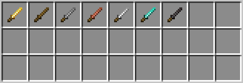
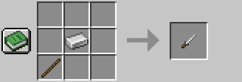

# DaggerCrafting

DaggerCrafting is a Minecraft mod that introduces throwable daggers as a new weapon type, blending fast-paced melee and ranged combat. Each dagger's stats and behavior are determined by its material, offering new strategic options.
Also its a lot of fun!

## Daggers

## Ranged Combat
When holding and releasing the right mouse button, the dagger will be thrown, similar to tridents.
- The **damage** the dagger deals on impactand the **speed** with which the dagger is thrown are based on the dagger's material.
- The **knockback** is based on the daggers current velocity in air, so it also scales with the dagger's material.

## Melee Combat
When in the main hand, the dagger will work just like a sword, but with much less damage and a faster attack speed.

## Enchantments
Daggers support the following vanilla enchantments:

### Vanilla
- **Loyalty**
    - Works similar to the trident's loyalty, but the math for how the dagger returns is different, where speed and acceleration are based on the dagger's material.
    - Getting this enchantment on a dagger is essential to make the dagger a viable ranged weapon.
- **Fire Aspect**
    - Works just like in vanilla. Sets the target on fire for 5 secconds on melee attacks.
- **Flame**
    - Works just like in vanilla. Sets the dagger andtarget on fire for 5 secconds on ranged attacks.

*These enchantments work just like in vanilla. Their modifiers are applied on **melee and ranged attacks**.*

- **Sharpness**
- **Smite**
- **Bane of Arthropods**

### Custom enchantments
- **Throwin Speed**
    - This enchantment increases the speed of the dagger when thrown.
    - The additional speed increases the range and knockback of the dagger.
    - Available in levels I - III.
    - This enchantment dramatically increases the usablitlity of the dagger as a ranged weapon.

## Stats
Below you find a list of all daggers and their stats.

### Dagger Material Stats

| Material        | Durability | Mining Speed | Attack Damage | Enchantability | Ranged Damage | Ranged Velocity |
|----------------|------------|--------------|---------------|----------------|---------------|----------------|
| Wooden Dagger  | 30         | 2.0          | 2.0           | 15             | 3.0           | 1.4            |
| Stone Dagger   | 50         | 2.0          | 3.0           | 12             | 5.0           | 1.6            |
| Iron Dagger    | 100        | 2.0          | 4.0           | 11             | 7.0           | 1.8            |
| Golden Dagger  | 20         | 2.0          | 2.0           | 25             | 3.0           | 1.6            |
| Diamond Dagger | 250        | 2.0          | 5.0           | 10             | 8.0           | 2.0            |

---

